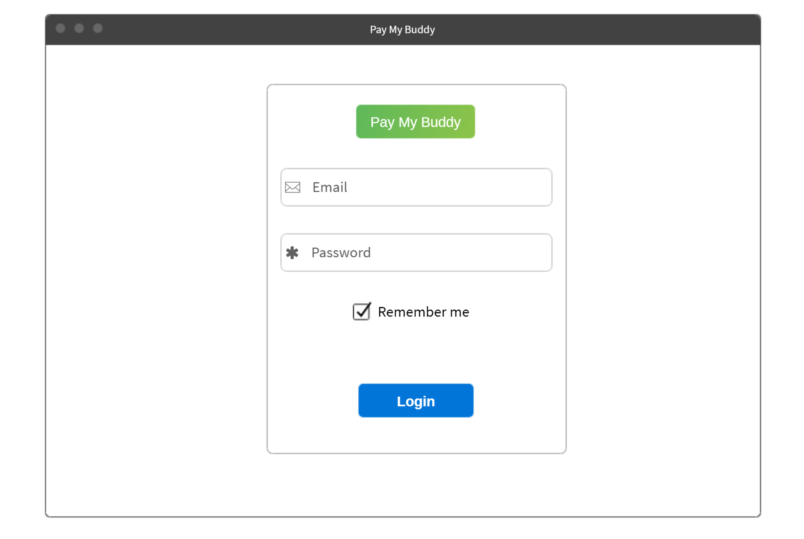
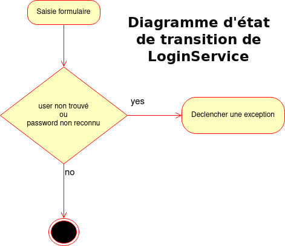

# Pay my Buddy
> Build an app that would allow customers to transfer money to manage their finances or pay their friends.
.
.
   

## Table of Contents
* [General Info](#general-information)
* [Technologies Used](#technologies-used)
* [diagrams](#diagrams)
* [SQL Script](#SQL-Script)
* [Code layout](#code-layout)
* [The back end](#The-back-end)
* [Test](#Test)
* [Acknowledgements](#acknowledgements)
* [Contact](#contact)

   
## General Information
- this application was designed on the SVM model.
- An "mpd" database was created and fed independently of the application.The Users table was fed "manually" via an sql script
- Entering transaction descriptions has not been implemented in this prototype. this information can only be entered directly into the database.
   

## Technologies Used
- Java - version 11.0
- ReactJS
- CSS - version 3.0
- Mysql /Sql

## diagrams

   
# SQL-Script
Creation of the database, and user, contact, money_transaction tables: 

CREATE DATABASE pmb ;
USE pmb;
CREATE TABLE user
(
    email    VARCHAR(320) NOT NULL,
    password VARCHAR(110)  NOT NULL,
    solde    DECIMAL      NOT NULL,
    PRIMARY KEY (email)
)
    ENGINE = INNODB;

CREATE TABLE contact
(
    email_origin  VARCHAR(320) NOT NULL,
    email_contact VARCHAR(320) NOT NULL,
    name          VARCHAR(40)  NOT NULL,
    PRIMARY KEY (email_origin, email_contact),
    CONSTRAINT fk_contact_email_origin_user FOREIGN KEY (email_origin) REFERENCES user (email),
    CONSTRAINT fk_contact_email_contact_user FOREIGN KEY (email_contact) REFERENCES user (email)
)
    ENGINE = INNODB;

CREATE TABLE money_transaction
(
    id              BIGINT       NOT NULL AUTO_INCREMENT,
    email_origin    VARCHAR(320) NOT NULL,
    email_recipient VARCHAR(320) NOT NULL,
    description     VARCHAR(100)  NOT NULL,
    creation_date   DATETIME     NOT NULL,
    amount          DECIMAL      NOT NULL,
    PRIMARY KEY (id),
    CONSTRAINT fk_money_transaction_email_origin_user FOREIGN KEY (email_origin) REFERENCES user (email),
    CONSTRAINT fk_money_transaction_email_recipient_user FOREIGN KEY (email_recipient) REFERENCES user (email)
)
    ENGINE = INNODB;

Data insertion Scritp :

## code-layout

The back end (in spring) is in src/main/java
The front end (in react https://reactjs.org/) is in src/main/js et src/main/resources/static (for the css style and the built application).
The front end also has additional files:
* .json package listing dependencies (like pom)
* The.json package-lock listing the version of the dependencies (pom contains this part)
* .config.js webpack: a file used to build the front-end application

The src / main / resources / templates / index.html file is the entry point file for the Front application.

The src / main / resources / static and src / main / resources / templates directories are served by the back-end: the back-end will transmit them to the client. As for a website.

compilation and start of the front-end :
npm run watch

## The back end
The back-end part of the application is based on the Model Vue Controller model.

controllers forward requests from the front-end to the back-end and 
the controllers transmit the requests coming from the front-end to the back-end and feed their result from the back-end to the front-end

the "view" class is the entry point of the web application.

Model:
the ContactId class is identical to the Contact Class of the model package.
It was created to be used as an entity in the ContactRepository class which requires an entity and its Id as a parameter

## Test
Overall coverage of 72% due to the java class used for the web application (HomeController), as well as the ContactId class ("relay" class between Contact and ContactRepository) whose tests would not have been relevant

## Acknowledgements
Give credit here.
- Many thanks to my mentor Pierre FOUCHET who gave me great help, especially on the front-end part

## Contact
Created by [@olivtopa] - feel free to contact me!

   

   

   

   

